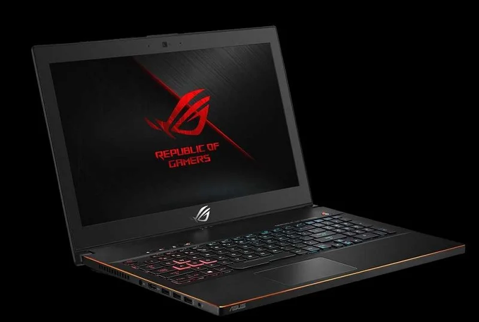

### Asus Zephyrus M GM501GS Monterey Hackintosh

#

### Clover 🍀 5145 | macOS Monterey 12.2.1
#

#

### 📸 About

#

### 💻 Hardware

#

### 📃 Specs

* CPU: Intel Core i7-8750H Coffee Lake
* GPU: Intel UHD 630 (NVIDIA not supported - disabled)
* RAM: 32GB DDR4
* Memory: Sabrent 1TB NVME
* WIFI/Bluetooth: Replaced stock chip with DW1560
* Camera: USB2.0 HD UVC WebCam
* Audio/Mic: Realtek HD Audio ALC3328 (ALC294 codec)
* Keyboard & Trackpad - ELAN/SA473I-12A4 (ELAN1201)

### ❌ Not Working:
  Keyboard backlight control (can change in Windows)
#
  
### ⚙️ BIOS Settings

- "VT-d" (virtualization for directed i/o) -disabled (if possible)
- "DEP" (data execution prevention) -enabled
- "secure boot " -disabled
- "legacy boot" optional (recommend enabled, but boot UEFI if you have it)
- "CSM" (compatibility support module) enabled or disabled (varies) (recommend enabled, but boot UEFI)
- "fast boot" (if available) -disabled.
- "boot from USB" or "boot from external" -enabled
- SATA mode (if available) - AHCI
#

### ❗️ Usage (How to install)

1. Fill the [SMBIOS](https://www.tonymacx86.com/threads/an-idiots-guide-to-imessage.196827) section according to this guide. 
2. Update BIOS to the latest version
#
  
### 🙏 Credits - 
  
 1. A huge thanks to [kylergib](https://github.com/kylergib/Asus-Zephyrus-M-gm501gs-Mojave). I used his Mojave build as reference to install Mojave. Build updated to Catalina ➡️ Monterey.
 2. Also thanks to [dggomes](https://github.com/dggomes/asuszephyrus-m). Used his build as reference when testing.
