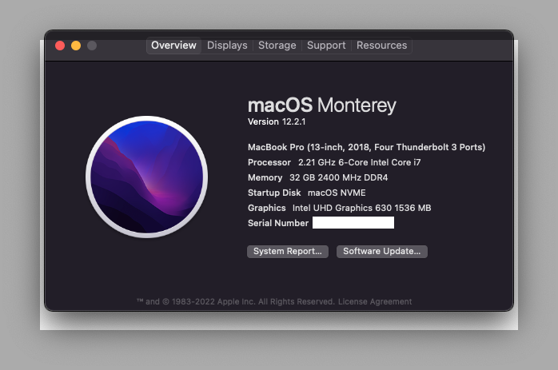

### Asus Zephyrus M GM501GS Monterey Hackintosh

#

### Clover 🍀 5145 | macOS Monterey 12.2.1
#

### 📸 About

### 📃 Hardware

* CPU: Intel Core i7-8750H Coffee Lake
* GPU: Intel UHD 630 (NVIDIA not supported - disabled)
* RAM: 32GB DDR4
* Memory: Sabrent 1TB NVME
* WIFI/Bluetooth: Replaced stock chip with DW1560
* Camera: USB2.0 HD UVC WebCam
* Audio/Mic: Realtek HD Audio ALC3328 (ALC294 codec)
* Keyboard & Trackpad - ELAN/SA473I-12A4 (ELAN1201)

### Not Working:
  Keyboard backlight control (can change in Windows)
  
### ❗️ Usage

How to install

1. Fill the [SMBIOS](https://www.tonymacx86.com/threads/an-idiots-guide-to-imessage.196827) section according to this guide. 
2. Update BIOS to the latest version
